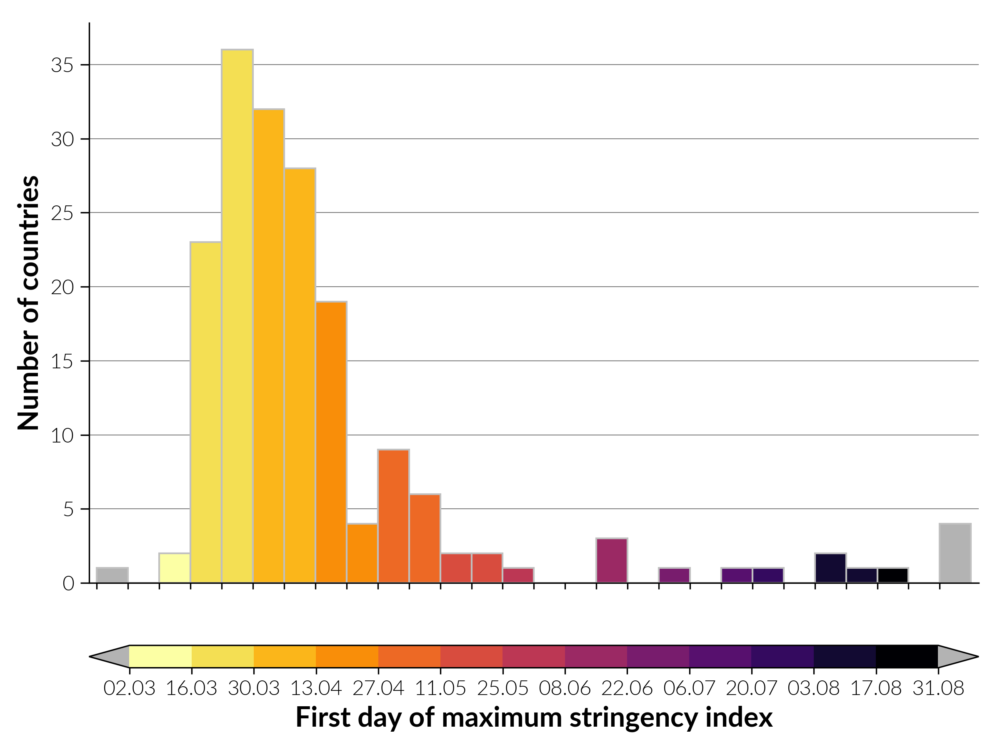
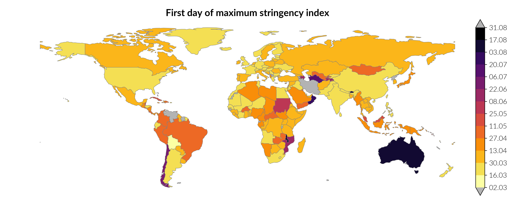
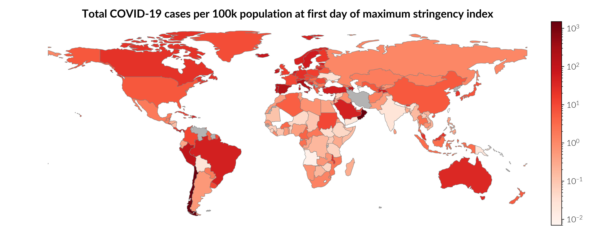
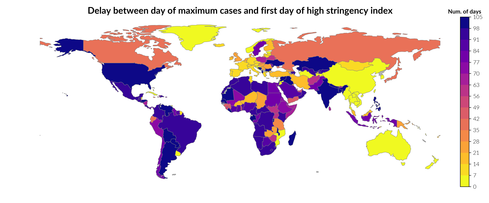
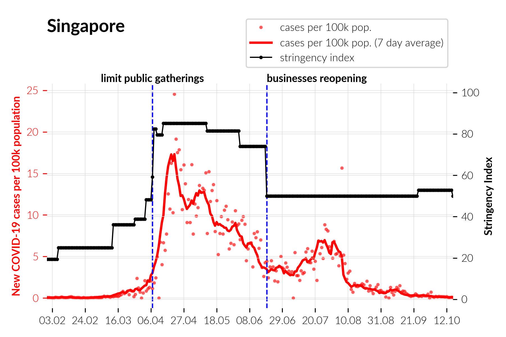
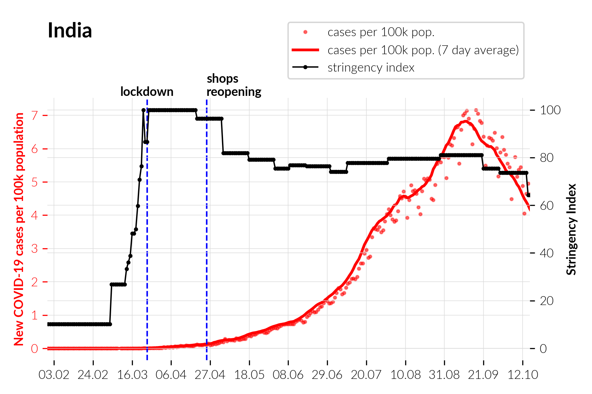
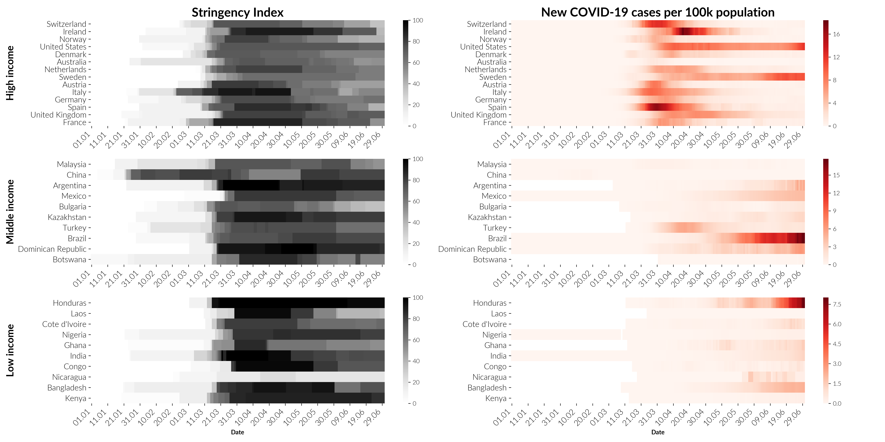
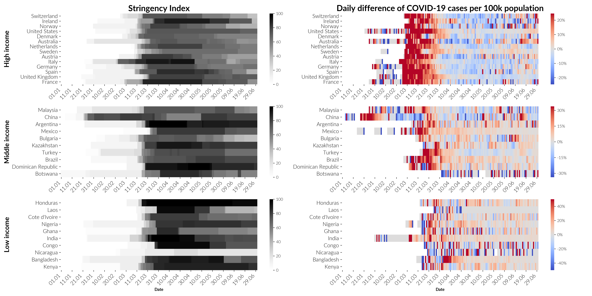

# Datasets
 

# Description of files

The present folder contains the datasets to generate (interactive) plots.

1. Those **downloaded** by the notebook [blogpost-stringency-measures_save-data.ipynb](../reports/blogpost_stringency_measures/blogpost-stringency-measures_save-data.ipynb) are:

    * [COVID-19_OWID.csv](COVID-19_OWID.csv)  
        COVID-19 statistics from *Our World in Data*.

    * [OxCGRT_latest.csv](OxCGRT_latest.csv)  
        Measures implemented by governments from Oxford University, including the stringency index.
  
    * [gdp_per_capita.xls](gdp_per_capita.xls)  
        Gross domestic product (GDP) per capita at purchasing power parity (PPP) (constant 2017 international dollars), downloaded from the World Bank at [https://data.worldbank.org/indicator/NY.GDP.PCAP.PP.KD](https://data.worldbank.org/indicator/NY.GDP.PCAP.PP.KD).

2. Those **created** by the notebook [blogpost-stringency-measures_save-data.ipynb](../reports/blogpost_stringency_measures/blogpost-stringency-measures_save-data.ipynb) from the downloaded ones are:
    * [histo_num_countries_vs_first_day_max_stringency.csv](histo_num_countries_vs_first_day_max_stringency.csv)

        Data for histogram of the number of country with maximum stringency index in a given date range (<u>see Fig. 1 left panel in the blogpost</u>)  
        
        
        
        * `start_date` column contains the dates you see in the histogram and colorbar
        * `num_countries` is the height of the bars
        * `color` is the related color

    * [geodata_COVID-19_stringency_delay.geojson](geodata_COVID-19_stringency_delay.geojson)  
        GeoJSON containing the geographical boundaries of countries in 'geometry' field which are necessary to create the map with country boundaries, at least when using `matplotlib` alone. May not need in DASH with `plotly` as there are [different options](https://plotly.com/python/mapbox-layers/) to show geographical maps or [choropleth maps](https://plotly.com/python/choropleth-maps/).  The field `iso_a3` is the ISO code for the country (there are duplicates).
        
        The following columns are used to produce the static images:  

        * <u>Figure 1 (right)</u>, using `first_day_max_stringency` (datetime type) or `first_day_max_stringency_numerical` (number to be mapped to a date), colors for each country are in `color_first_day_max_stringency`, the colormap is `inferno_r`.
        
            
        
        * <u>Figure 4</u>, using `total_cases_per_100k_at_first_day_max_stringency`, the colormap is `Reds`.
        
            

        * <u>Figure 6</u>, using `delay_day_max_new_cases_per_100000_first_day_sim_max_stringency_numerical_2020-03-01_2020-06-30`, colors for each country are in `color_delay_sim_max_stringency`, the colormap is `plasma_r`.

            

    * [COVID-19_stats_stringency_index.csv](COVID-19_stats_stringency_index.csv)  
        Stored all the columns from one of the original files that composes it, the COVID-19 statistics from *Our World in Data* at [COVID-19_OWID.csv](COVID-19_OWID.csv). Many can be removed if the file size in the memory is an issue.
        
        * <u>Figure 2</u>, using column `new_cases_per_100000` for red dots, `new_cases_per_100000_7_day_average` for red line, and `stringency_index` for red dots connected by a line. Contry codes can be found in `iso_code` or `Country Code`, days for the time series in `date` or `Date` columns.  
            
            

        * <u>Figure 3</u>, using heatmap function to plot column `stringency_index` for the left (black) part of the figure and `new_cases_per_100000_7_day_average` for right (red) part. Countries subdivided by GDP per capita are categorized in `category_gdp_per_capita`, those selected for the plot has `country_to_plot` set to `True`. Country names should be in `location` column.

            
        
        * <u>Figure 4</u>, using heatmap function to plot column `stringency_index` for the left (black) part of the figure and `new_cases_per_100000_7_day_average_daily_change` for right (`coolwarm` colormap) part. Countries subdivided by GDP per capita are categorized in `category_gdp_per_capita`, those selected for the plot has `country_to_plot` set to `True`. Country names should be in `location` column.

            

            Due to the presence of outliers, a robust span for the maximum and minumum values to display is defined as:
            ```python
            vmin = np.nanpercentile(df_cases_sel_coutries_moving_avg_daily_change, 2)
            vmax = np.nanpercentile(df_cases_sel_coutries_moving_avg_daily_change, 98)
            
            # Same magnitude for max and min of colorbar scale
            largest_vmin_vmax = min([abs(vmin),vmax])
            ```
            then setting as `vmin=-largest_vmin_vmax` and `vmax=largest_vmin_vmax` of the heatmap.

    * [dates_government_measures.csv](dates_government_measures.csv)
        Important dates of government restrictions (lockdowns/phase out) from ACAPS, manually added. Use it to plot vertical lines in line plots for COVID-19 cases and stringency index as in <u>Figure 2</u>. 


          
